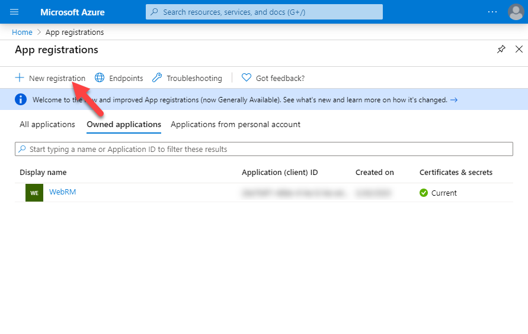

# vscode-webrm-auth 
Auth server for vscode-webrm

# Directions
Start by clicking the 'Deploy to Azure' button up above 🠕

Then fill out the deployment form, leaving Application ID, Appliocation Private Key, and Auth redirect url empty for now.

Click next and after the deployment is finished, write down the url. (https://your-site-name.azurewebsites.net).  

Go into Azure and create a new App Registration (Note, this is different from the App Service you just created).

Give your application a name, select whether it can be used for multiple tenants or signle tenant, then click Register

Click 'Certificates & secrets', then 'New client secret'. Enter a description and an expiration then click 'Add'  
*Be sure to copy down this client secret, as you will not be able to view it later (but you can always generated another)

Click 'API permissions', then 'Add a permission'

Find Dynamics CRM, select 'Delegated permissions', check the box 'user_impersonation', then click 'Add permissions'

Click 'Overview', copy down the Application ID, then click 'Add a Redirect URI'

Click 'Add a platform', enter the URL of the App Service that was deployed earlier (https://your-site-name.azurewebsites.net).

For the logout URL, enter the same URL as the Redirect URI with a '/logout' at the end:  
(https://your-site-name.azurewebsites.net/logout)

Click 'Configure', then add the following 2 redirect URIs  
    - 'https://your-site-name.azurewebsites.net/code'  
    - 'http://localhost/'  

Go back to the App Service that was deployed earlier, click 'Configuration', then enter the following values:  

Set CLIENT_ID to the Application ID you copied from the App Registration  
Set CLIENT_SECRET to the client secret you generated in the App Registration  
Set REDIRECT_URI to the App Service URL (https://your-site-name.azurewebsites.net)  
Leave FINAL_REDIRECT_URI set to 'http://localhost:8350/result'  

And that should be it! Your App Service should be ready to use with vscode-webrm.
